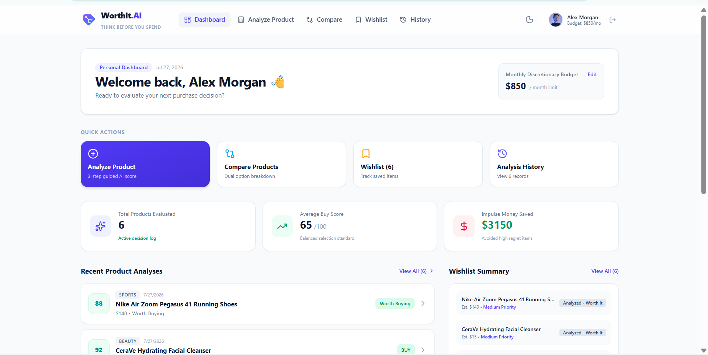
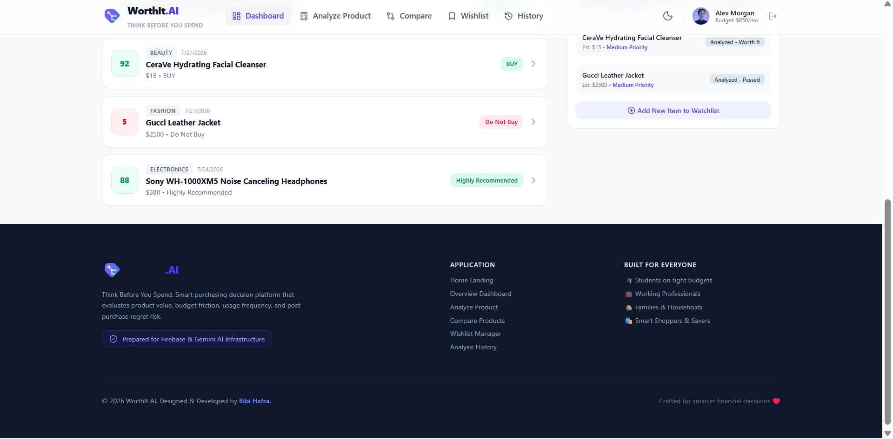
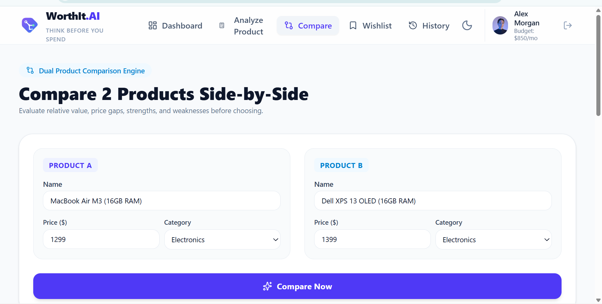
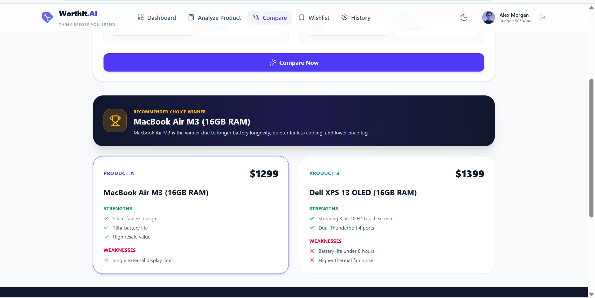
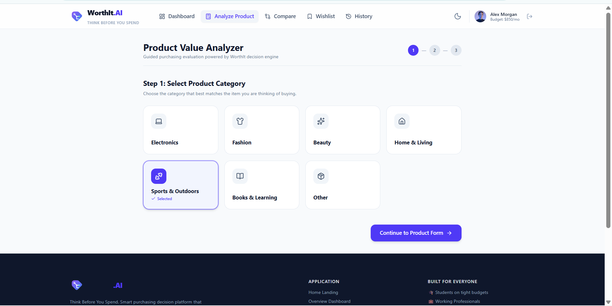
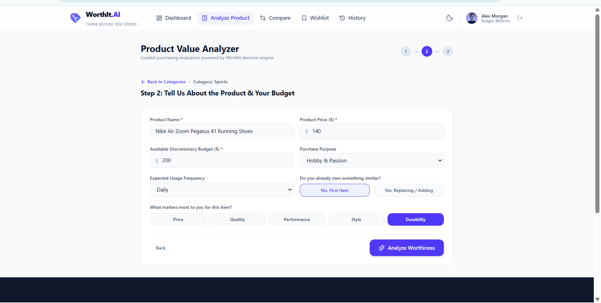
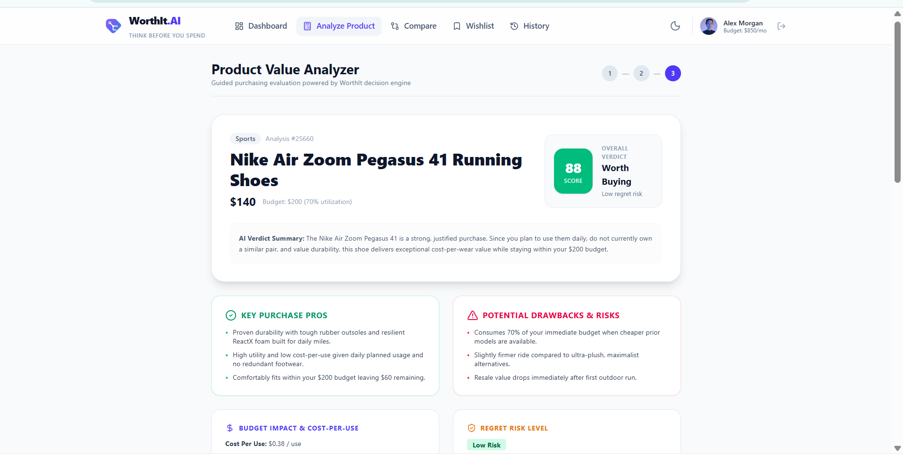
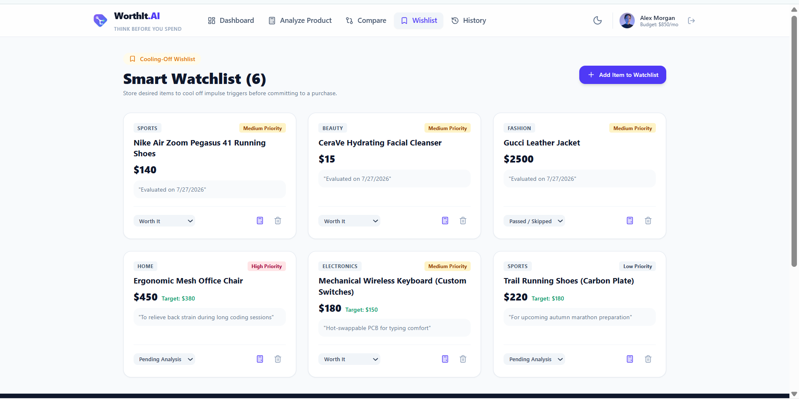
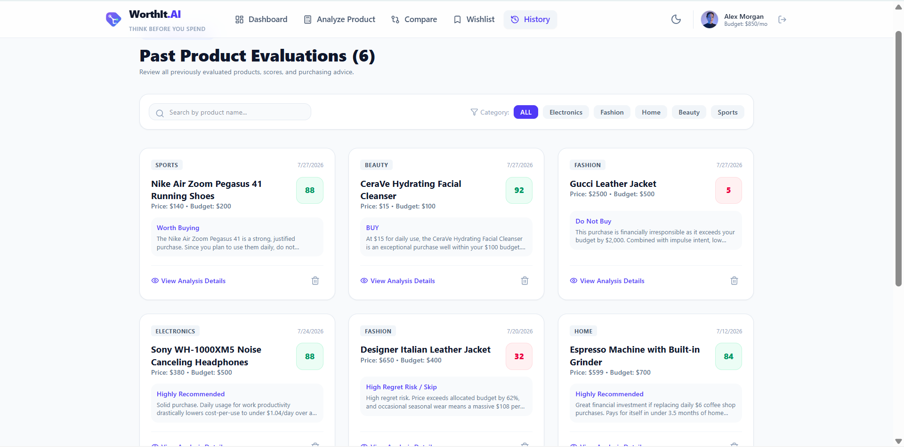
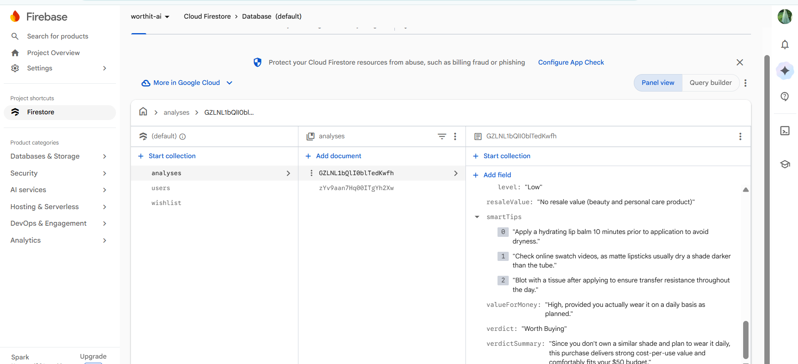

<div align="center">

  <a href="https://worthit-ai-c17n.vercel.app/" target="_blank">
    
  </a>

  # 🛍️ WorthIt AI

  <h3>Think Before You Spend. Smart AI-Powered Purchase Decision Assistant.</h3>

  <p align="center">
    <b>Stop buyer's remorse before it happens.</b><br />
    WorthIt AI leverages Google Gemini AI to analyze your purchases based on budget, price, usage frequency, existing items, purpose, and buying priorities — delivering personalized, data-driven buying recommendations instead of generic product reviews.
  </p>

  <p align="center">
    <a href="https://worthit-ai-c17n.vercel.app/" target="_blank">
      
    </a>
    &nbsp;&nbsp;
    <a href="https://github.com/chin6921/worthit-ai" target="_blank">
      
    </a>
  </p>

  <br />

  <!-- BADGES -->
  <p align="center">
    
    
    
    
    
    
    
    
  </p>

</div>

---

<br />

## 🌟 Interactive Preview Buttons

<div align="center">

| 🚀 **Live Production Application** | 💻 **GitHub Source Code Repository** |
| :---: | :---: |
| [](https://worthit-ai-c17n.vercel.app/) | [](https://github.com/chin6921/worthit-ai) |
| *Click above to test the live AI assistant* | *Explore full source code, components & logic* |

</div>

<br />

---

<h2 align="center">📖 Project Overview</h2>

<p align="center">
  <b>WorthIt AI</b> is an intelligent purchasing decision assistant engineered to eliminate buyer's remorse and impulse buying through hyper-personalized financial and utility evaluation.
</p>

### 🚨 The Real-World Problem
In today's e-commerce landscape, consumers are bombarded with aggressive marketing, flash sales, influencer hype, and thousands of generic 5-star product reviews. However:
- **Generic reviews don't know your budget**: A $500 gadget might be a great deal for someone earning $10,000/mo, but a financial burden for a student.
- **Reviews ignore what you already own**: You might already have 3 similar jackets or headphones sitting in your closet.
- **Impulse purchases lead to clutter and regret**: Millions of dollars are spent annually on items used only once or twice before gathering dust.

### 💡 The WorthIt AI Solution
**WorthIt AI** replaces superficial star ratings with a personalized **AI Decision Engine**. Powered by Google Gemini AI, it acts as your objective financial advocate:
1. **Evaluates personal context**: Factors in your monthly discretionary budget, frequency of intended use, existing similar possessions, and personal purchasing priorities.
2. **Generates holistic metrics**: Calculates an accurate **Buy Score (0-100)**, **Price Fairness**, **Resale Value**, **Lifespan Estimate**, and **Regret Risk Level**.
3. **Provides actionable guidance**: Suggests strategic waiting periods, smarter budget-friendly alternatives, or an explicit recommendation to **Skip**, **Think Twice**, or **Buy**.

---

<h2 align="center">✨ Key Features</h2>

<div align="center">

| Feature | Icon | Description |
| :--- | :---: | :--- |
| **AI Product Analysis** | 🤖 | Multi-factor evaluation engine generating personalized verdict, buy scores, and trade-off breakdowns. |
| **Wishlist Manager** | 🔖 | Save prospective purchases to enforce cooling-off periods and organize by priority and urgency. |
| **Analysis History** | 📜 | Instant persistent lookup of past evaluations powered by cloud storage for effortless comparison. |
| **Product Comparison** | ⚖️ | Side-by-side comparative analysis between competing products, models, or brand alternatives. |
| **Budget Impact Assessment** | 💰 | Real-time calculation of how a purchase impacts discretionary monthly cash flow and savings goals. |
| **Regret Risk Prediction** | ⚠️ | Predictive AI model calculating the probability of post-purchase underutilization or buyer remorse. |
| **Smart Buying Tips** | 💡 | Custom strategic advice on sales cycles, bundle deals, refurbishment options, and timing. |
| **Better Alternatives** | 🔄 | Smart discovery of cost-effective, higher-durability, or open-source alternatives. |
| **Firebase Cloud Storage** | ☁️ | Persistent document store for history logs, saved wishlists, and user decision tracking. |
| **Responsive Design** | 📱 | Fully optimized fluid layout across mobile, tablet, laptop, and ultra-wide desktop viewports. |
| **Dark & Light Mode** | 🌙 | High-contrast visual modes engineered for eye comfort during late-night shopping research. |
| **Modern UI/UX** | ⚡ | Micro-interactions, smooth tab transitions, floating navigation, and polished motion UI. |

</div>

---

<h2 align="center">🧠 Comprehensive AI Analysis Parameters</h2>

When you submit a product for evaluation, **WorthIt AI** processes **13 deep financial & utility metrics**:

```
                  ┌─────────────────────────────────────────┐
                  │          Product & Personal Input        │
                  │   (Price, Budget, Usage, Similar Items) │
                  └────────────────────┬────────────────────┘
                                       │
                                       ▼
                  ┌─────────────────────────────────────────┐
                  │      Google Gemini AI Engine            │
                  │   Contextual Decision Matrix Processing │
                  └────────────────────┬────────────────────┘
                                       │
                                       ▼
 ┌─────────────────────────────────────────────────────────────────────────┐
 │                        COMPREHENSIVE DECISION OUTPUT                    │
 ├───────────────────┬───────────────────┬─────────────────────────────────┤
 │ 📊 Buy Score      │ 👨‍⚖️ AI Verdict    │ 🎯 Confidence Level             │
 │ 💳 Budget Impact  │ 🏷️ Price Fairness │ 💎 Value for Money              │
 │ 📉 Resale Value   │ ⏳ Lifespan       │ 🚨 Regret Risk Level            │
 │ 👍 Pros & Cons    │ 🔄 Alternatives   │ 💡 Smart Actionable Tips        │
 └───────────────────┴───────────────────┴─────────────────────────────────┘
```

<br />

| Metric | Icon | What It Measures |
| :--- | :---: | :--- |
| **Buy Score** | 📊 | Overall score from 0 to 100 representing how strongly recommended the purchase is for you. |
| **Confidence Level** | 🎯 | AI certainty percentage based on the detail level provided in your input fields. |
| **AI Verdict** | 👨‍⚖️ | Clear decision recommendation: **Must Have** ✅, **Think Twice** ⚠️, or **Skip It** ❌. |
| **Pros & Cons** | 👍 👎 | Tailored advantages and realistic trade-offs tailored strictly to your lifestyle and budget. |
| **Budget Impact** | 💳 | Severity scale measuring the percentage drawdown on your discretionary monthly income. |
| **Price Fairness** | 🏷️ | Market value assessment indicating whether the item is overpriced, fair, or a steal. |
| **Value for Money** | 💎 | Long-term utility output relative to every dollar invested. |
| **Resale Value** | 📉 | Expected secondary market value retention over 1-3 years of usage. |
| **Lifespan Estimate** | ⏳ | Estimated operational durability and hardware/material longevity in months/years. |
| **Better Alternatives** | 🔄 | Curated recommendations offering better cost-to-performance or sustainable options. |
| **Smart Tips** | 💡 | Tactical buying guidance (e.g. "Wait for holiday sale", "Buy certified refurbished"). |
| **Regret Risk** | 🚨 | Probability breakdown (Low, Medium, High) of suffering buyer's remorse within 30 days. |

---

<h2 align="center">🛠️ Technology Stack</h2>

<div align="center">

| Category | Technology | Logo / Badge | Purpose |
| :--- | :--- | :---: | :--- |
| **Frontend Framework** | React 19 |  | Component-based UI architecture with fast virtual DOM rendering. |
| **Type Safety** | TypeScript 5.8 |  | Strict compile-time type safety, interfaces, and developer productivity. |
| **Build Tool** | Vite 6 |  | Next-generation ultra-fast frontend build tooling and dev server. |
| **Styling** | Tailwind CSS v4 |  | Utility-first CSS engine for high-performance visual design. |
| **AI Model Engine** | Google Gemini AI |  | Multi-factor structured JSON generation via `@google/genai` SDK. |
| **Backend & Storage** | Firebase Firestore |  | NoSQL cloud document database for saving user history and wishlists. |
| **Animation Engine** | Motion (Framer) |  | Smooth layout animations, page transitions, and subtle UI feedback. |
| **Iconography** | Lucide React |  | Modern, accessible vector icons for clean component UI. |
| **Deployment** | Vercel |  | Automated CI/CD global edge network deployment. |

</div>

---

<h2 align="center">📁 Project Folder Structure</h2>

<details open>
<summary><b>Click to expand/collapse directory tree</b></summary>

```filetree
worthit-ai/
├── 📁 public/
│   └── favicon.svg                    # Application Favicon & Branding Asset
├── 📁 src/
│   ├── 📁 components/
│   │   ├── 📁 analysis/               # Product Decision Wizard & Form Components
│   │   │   └── ProductAnalysisWizard.tsx
│   │   ├── 📁 auth/                   # Authentication & User Modal Dialogs
│   │   │   └── AuthModal.tsx
│   │   ├── 📁 common/                 # Reusable UI Controls & Brand Logos
│   │   │   └── WorthItLogo.tsx
│   │   ├── 📁 compare/                # Side-by-Side Product Comparison Interface
│   │   │   └── ProductCompare.tsx
│   │   ├── 📁 dashboard/              # Main Analytics & Recommendation Dashboard
│   │   │   └── Dashboard.tsx
│   │   ├── 📁 history/                # Saved Decision Log & History Table
│   │   │   └── AnalysisHistory.tsx
│   │   ├── 📁 landing/                # Public Marketing Landing Page Component
│   │   │   └── LandingPage.tsx
│   │   ├── 📁 wishlist/               # Wishlist Manager & Cooling-Off Tracker
│   │   │   └── WishlistManager.tsx
│   │   ├── Footer.tsx                 # Global Application Footer
│   │   ├── Navbar.tsx                 # Global Navigation Bar with Theme Toggle
│   │   └── Toast.tsx                  # Interactive Toast Notification Container
│   ├── 📁 context/
│   │   └── AppContext.tsx             # Global React Context & State Provider
│   ├── 📁 data/
│   │   └── mockData.ts                # Sample Products & Fallback Analytics Data
│   ├── 📁 lib/
│   │   ├── ai.ts                      # Google Gemini AI Integration & Prompt Templates
│   │   └── firebase.ts                # Firebase Cloud Firestore Initialization
│   ├── 📁 types/
│   │   └── index.ts                   # Global TypeScript Definitions & Interfaces
│   ├── App.tsx                        # Main Application Router & Layout Orchestrator
│   ├── index.css                      # Tailwind CSS v4 Theme Directives & Base Styles
│   └── main.tsx                       # React Application Mounting Entrypoint
├── .env.example                       # Environment Variable Declarations Template
├── .gitignore                         # Git Repository Exclusion Configuration
├── index.html                         # Main HTML Template Document
├── metadata.json                      # AI Studio Application Metadata
├── package.json                       # Dependencies, Scripts & Package Manifest
├── tsconfig.json                      # TypeScript Compiler Settings
└── vite.config.ts                     # Vite Dev Server & Build Bundler Config
```

</details>

---

<h2 align="center">🖼️ Application Screenshots & UI Showcase</h2>

<div align="center">

| 🌐 **Landing Page & Hero** | 📊 **Smart Decision Dashboard** |
| :---: | :---: |
|  |  |
| *Hero section introducing AI purchase evaluation* | *Overview of buy scores, budget impact, and recent insights* |
---
<br />
     ↔️ **Side-by-Side Product Comparison** 
     | 
*Comparative analysis matrix between 2+ competing items* 

---

<br/>


| 🤖 **AI Product Analysis Wizard** | ⚖️ **best product analyze** |
| :---: | :-
 
  |

 *Multi-factor form evaluating budget, usage, & need* 
 
 ---
 
<br />

| 🔖 **Wishlist & Cooling-Off Tracker** | 📜 **Analysis History & Cloud Sync** |
| :---: | :---: |
|  |  |
| *Cooling-off timer and priority tagging to delay impulse buys* | *Persistent Firestore database of all past product evaluations* |

<br />

| ☁️ **Firebase Firestore Database** |
| :---: |
|  |
| *Secure, scalable real-time Cloud Firestore backend storing user decision records* |

</div>

---

<h2 align="center">⚡ Quick Start & Installation</h2>

Follow these simple steps to run **WorthIt AI** locally on your machine:

### 1. Prerequisites
Ensure you have the following installed:
- [Node.js](https://nodejs.org/) (version `v18.0.0` or higher)
- `npm` or `yarn` / `pnpm`

### 2. Clone the Repository
```bash
git clone https://github.com/chin6921/worthit-ai.git
cd worthit-ai
```

### 3. Install Dependencies
```bash
npm install
```

### 4. Set Up Environment Variables
Create a `.env` file in the project root directory (refer to `.env.example`):
```bash
cp .env.example .env
```
Fill in your API key details inside `.env`:
```env
GEMINI_API_KEY="YOUR_GEMINI_API_KEY_HERE"
```

### 5. Launch Development Server
```bash
npm run dev
```
Open your browser and navigate to `http://localhost:3000` to access WorthIt AI locally!

### 6. Build for Production
To generate a production build:
```bash
npm run build
npm run preview
```

---

<h2 align="center">🔐 Environment Variables</h2>

The application uses the following environment variables. Ensure these are defined in your deployment platform or local `.env` file:

```env
# Required: Google Gemini AI API Key
GEMINI_API_KEY="YOUR_GEMINI_API_KEY"

# Optional: Application Host URL
APP_URL="http://localhost:3000"

# Optional: Firebase Config (if using custom Firebase Project)
VITE_FIREBASE_API_KEY="YOUR_FIREBASE_API_KEY"
VITE_FIREBASE_AUTH_DOMAIN="YOUR_FIREBASE_AUTH_DOMAIN"
VITE_FIREBASE_PROJECT_ID="YOUR_FIREBASE_PROJECT_ID"
VITE_FIREBASE_STORAGE_BUCKET="YOUR_FIREBASE_STORAGE_BUCKET"
VITE_FIREBASE_MESSAGING_SENDER_ID="YOUR_FIREBASE_MESSAGING_SENDER_ID"
VITE_FIREBASE_APP_ID="YOUR_FIREBASE_APP_ID"
```

---

<h2 align="center">🔄 Application Workflow</h2>

```
  +-------------------------------------------------------------------------+
  | STEP 1: USER INPUT & CONTEXT                                            |
  | - Enter Product Name, Category, Price, and URL/Description              |
  | - Define Discretionary Monthly Budget & Usage Frequency                 |
  | - Specify Owned Similar Items & Primary Buying Goal                     |
  +------------------------------------┬------------------------------------+
                                       |
                                       ▼
  +-------------------------------------------------------------------------+
  | STEP 2: GEMINI AI CONTEXTUAL PROCESSING                                 |
  | - Prompt engineering structures multi-variable decision parameters      |
  | - Calculates price-to-budget ratio, longevity index, & alternative map  |
  | - Returns strict validated JSON output via @google/genai SDK            |
  +------------------------------------┬------------------------------------+
                                       |
                                       ▼
  +-------------------------------------------------------------------------+
  | STEP 3: INTERACTIVE DECISION DASHBOARD                                  |
  | - Displays AI Verdict (Must Have / Think Twice / Skip)                  |
  | - Renders Buy Score meter (0-100), Regret Risk level, & Financial Impact|
  | - Lists Tailored Pros/Cons, Price Fairness, and Resale Estimates        |
  +------------------------------------┬------------------------------------+
                                       |
                                       ▼
  +-------------------------------------------------------------------------+
  | STEP 4: PERSISTENCE & ACTIONS                                           |
  | - Save item to Wishlist for 7/14/30 day cooling-off period              |
  | - Store analysis permanently in Firebase Cloud Firestore                |
  | - Compare with alternative models in Product Comparison Matrix          |
  +-------------------------------------------------------------------------+
```

---

<h2 align="center">✅ Current MVP Features</h2>

- [x] **AI Decision Engine**: Full Gemini AI integration for multi-variable purchase analysis.
- [x] **Buy Score Meter**: Visual score gauge (0-100) reflecting personalized recommendation score.
- [x] **Structured AI Verdict**: Categorized recommendation outputs (Must Have / Think Twice / Skip).
- [x] **Comprehensive Pros & Cons**: Context-aware trade-off analysis.
- [x] **Budget Impact Analysis**: Calculates discretionary income impact percentage.
- [x] **Regret Risk Scoring**: Predictive risk evaluation of impulse regret.
- [x] **Better Alternatives Generator**: Curated alternative suggestions based on cost & longevity.
- [x] **Wishlist & Cooling-Off Tracker**: Save prospective items to enforce waiting periods.
- [x] **Analysis History**: Cloud-persisted log of all previous decision reports via Firebase Firestore.
- [x] **Product Comparison Matrix**: Side-by-side evaluation of competing products.
- [x] **Responsive Mobile-First UI**: Tailwind CSS v4 layout optimized for all device sizes.
- [x] **Dark & Light Mode**: Seamless dark/light theme switching with stored theme preferences.

---

<h2 align="center">🚀 Future Roadmap</h2>

- [ ] **Firebase Authentication**: User accounts, Google OAuth, and personal synchronized profiles.
- [ ] **Real-Time Price Tracking**: Automated price drop alerts and historical price chart graphs.
- [ ] **AI Shopping Assistant Chat**: Interactive conversational assistant to debate potential purchases.
- [ ] **Receipt Scanner**: Upload physical receipts to automatically log and analyze previous purchases.
- [ ] **Barcode Scanner**: Scan physical in-store barcodes via camera to trigger instant AI evaluation.
- [ ] **Push Notifications**: Reminders when a wishlist item's cooling-off period expires.
- [ ] **Spending Analytics Dashboard**: Visual charts showing money saved by skipping unneeded items.
- [ ] **Document & Invoice OCR**: Image text extraction from store screenshots and PDF quotes.
- [ ] **Amazon & E-Commerce Integration**: One-click import of product specs directly from product URLs.

---

<h2 align="center">👩‍💻 Developer Profile</h2>

<div align="center">

  <h3>Bibi Hafsa</h3>
  <p><b>BS Computer Science Student | Frontend Developer | AI Enthusiast</b></p>

  <p>
    Passionate about building modern, human-centric web applications powered by generative AI.<br />
    Focused on clean architecture, accessible user experiences, and responsive design systems.
  </p>

  <p>
    <a href="https://github.com/chin6921" target="_blank">
      
    </a>
    &nbsp;&nbsp;
    <a href="https://www.linkedin.com/in/bibi-hafsa42382/" target="_blank">
      
    </a>
  </p>

</div>

---

<h2 align="center">⭐ Support & Feedback</h2>

<div align="center">

If you find **WorthIt AI** helpful or inspiring, please consider giving this repository a **Star**! ⭐
It helps support open-source development and boosts project visibility.

<br />

[](https://github.com/chin6921/worthit-ai/stargazers)

<br />

*Have suggestions, feature requests, or bugs to report? Feel free to open an issue or pull request!*

</div>

---

<br />

<div align="center">

  ### Ready to stop impulse buying?

  <a href="https://worthit-ai-c17n.vercel.app/" target="_blank">
    
  </a>

  <br /><br />

  <p>
    Crafted with ❤️ by <b>Bibi Hafsa</b> • Powered by <b>Google Gemini AI</b> & <b>React</b><br />
    © 2026 WorthIt AI. All Rights Reserved.
  </p>

</div>
